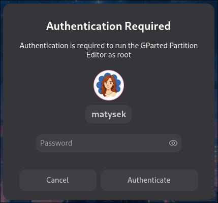

<div align="center">

# Cutekit

**Cutekit** is a sleek and modern Polkit authentication agent written in GTK, designed to work with any desktop environment.
It is a **friendly fork** of [Soteria](https://github.com/imvaskel/soteria), extended with:

</div>

- **Custom GNOME-style interface** for a polished, integrated feel
- **Theme-aware design** + optional user-defined CSS
- **Dimmed** screen, when widnow is launched
- **Built-in configuration** via JSON and toml
- **Layer shell integration** for easier interaction
- Improved UX and layout

<div align="center">
</image>
</div>

[Installation](#installation) •
[Why?](#why) •
[Configuration](#configuration) •
[Usage](#usage)

## Installation

Cutekit requires GTK >= 4.16. For Arch based distros, you will need
`gtk4`, Debian based distros will need `libgtk-4-dev`, and Fedora
based distros will need `gtk4-devel`.

Additionally, you will need `polkit` and `libpolkit-agent` installed.
(`libpolkit-agent` should be shipped with `polkit`).

> [!NOTE]
> If the executable `polkit-agent-helper-1`
> is in a non-standard location (i.e. not `/usr/lib/polkit/polkit-agent-helper-1`), then you should also set up a configuration file
> at either `/usr/local/etc/cutekit/config.toml` or `/etc/cutekit/config.toml` with
>
> ```toml
> helper_path = "/path/to/your/helper"
> ```
>
> as the contents.

Cutekit will also need Rust. It was developed on Rust `1.86.0` however,
lower versions of Rust should still work.

Run the following commmand to build and install Cutekit:

```bash
cargo install --locked --git https://github.com/mistrmochov/cutekit
```

This should place Cutekit into ~/.cargo/bin and you can run it from there.

Or if you use Nix, Cutekit is packaged there. There is a NixOS module to enable it under `security.soteria.enable`.

## Usage

Simply have your desktop run the `cutekit` binary to have it register as your authentication agent. Once run, anytime an application requests polkit authentication, it should popup and prompt you to authenticate.

For Hyprland, this would look like:

```conf
exec-once = /path/to/cutekit
```

You may also like:

Other desktop environments should be similar.

By default, Cutekit uses the "overlay" layer in layer-shell. If you’re using an on-screen keyboard (which typically appears on the "top" layer), you can change the layer in `~/.config/cutekit/config.json` to `"top"`.

The ~/.config/cutekit/config.json is automatically generated if missing, you can set your logo here, the width of the border aroung logo and color of that border.

You can also create your own `style.css` in `~/.config/cutekit/` to customize the appearance. You can inspect the cutekit.ui file in source code to track down css classes.

## Why?

Soteria is an amazing project and all the polkit logic goes to it's creator. I forked and created this project, because I wanted to make a polkit, that stands out in design and I also wanted it to be in layer-shell. I took an inspiration from the built in GNOME polkit design.

## Debugging

If you would like to debug why something went wrong, just run `RUST_LOG=debug cutekit` and this will start it with debug logging, which should help you identify what's going wrong.
